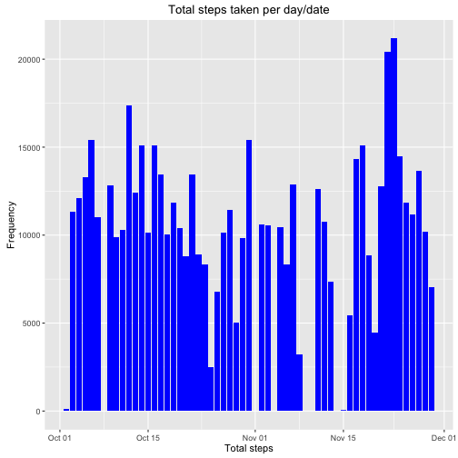
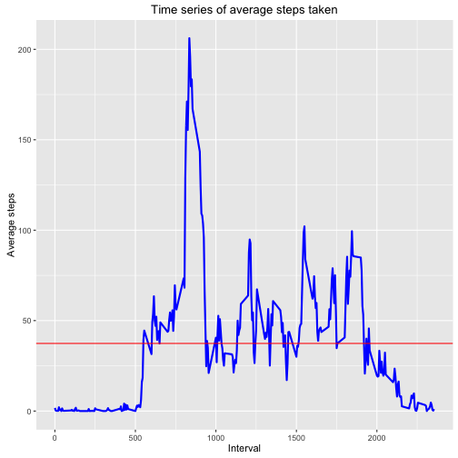
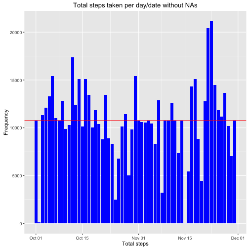
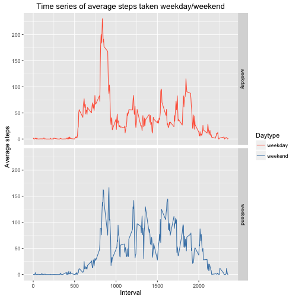

Coursera: Reproducible Research - Course Project 1
==================================================

# Loading the data and getting an overview


```r
activityData <- read.csv("activity.csv", header = TRUE)
head(activityData)
```

```
##   steps       date interval
## 1    NA 2012-10-01        0
## 2    NA 2012-10-01        5
## 3    NA 2012-10-01       10
## 4    NA 2012-10-01       15
## 5    NA 2012-10-01       20
## 6    NA 2012-10-01       25
```

```r
summary(activityData)
```

```
##      steps                date          interval     
##  Min.   :  0.00   2012-10-01:  288   Min.   :   0.0  
##  1st Qu.:  0.00   2012-10-02:  288   1st Qu.: 588.8  
##  Median :  0.00   2012-10-03:  288   Median :1177.5  
##  Mean   : 37.38   2012-10-04:  288   Mean   :1177.5  
##  3rd Qu.: 12.00   2012-10-05:  288   3rd Qu.:1766.2  
##  Max.   :806.00   2012-10-06:  288   Max.   :2355.0  
##  NA's   :2304     (Other)   :15840
```

```r
str(activityData)
```

```
## 'data.frame':	17568 obs. of  3 variables:
##  $ steps   : int  NA NA NA NA NA NA NA NA NA NA ...
##  $ date    : Factor w/ 61 levels "2012-10-01","2012-10-02",..: 1 1 1 1 1 1 1 1 1 1 ...
##  $ interval: int  0 5 10 15 20 25 30 35 40 45 ...
```

# Transforming date variable from character to date


```r
activityData$date <- as.Date(activityData$date)
```

## Calculate total number of steps taken per day


We melt the data frame to cast by date - the id variable is set to date and the measure variable is set to steps. This way, we get a table with values for steps taken per day


```r
activityMeltDate <- melt(activityData, id.vars="date", measure.vars="steps", na.rm=FALSE)
```

Next, we cast the data frame to see the steps per day (in a table with three columns)


```r
activityCastDate <- dcast(activityMeltDate, date ~ variable, sum)
```

# Plot histogram of total steps per day


```r
library(ggplot2)
stepshist <- ggplot(activityCastDate, aes(date, steps))
stepshist + geom_bar(stat = "identity", fill = "blue") +
  ggtitle("Total steps taken per day/date") +
  xlab("Total steps") +
  ylab("Frequency") +
  geom_hline(aes(yintercept=mean(steps)), col = "red")
```

```
## Warning: Removed 8 rows containing missing values (position_stack).
```

```
## Warning: Removed 61 rows containing missing values (geom_hline).
```



# Calculate mean and median number of steps taken each day


```r
mean_steps <- round(mean(activityCastDate$steps, na.rm = TRUE),2)
mean_steps
```

```
## [1] 10766.19
```


```r
median_steps <- round(median(activityCastDate$steps, na.rm = TRUE),2)
median_steps
```

```
## [1] 10765
```

# Create a time series plot of the average number of steps taken


```r
interval<- activityData%>%
        group_by(interval)%>%
        filter(!is.na(steps))%>%
        summarise(avg_steps = mean(steps, na.rm=TRUE))
interval
```

```
## # A tibble: 288 × 2
##    interval avg_steps
##       <int>     <dbl>
## 1         0 1.7169811
## 2         5 0.3396226
## 3        10 0.1320755
## 4        15 0.1509434
## 5        20 0.0754717
## 6        25 2.0943396
## 7        30 0.5283019
## 8        35 0.8679245
## 9        40 0.0000000
## 10       45 1.4716981
## # ... with 278 more rows
```

Now, we plot the time series


```r
time_series <- ggplot(interval, aes(interval, avg_steps))
time_series +
  geom_line(col = "blue", lwd = 1) + 
  ggtitle("Time series of average steps taken") +
  xlab("Interval") +
  ylab("Average steps") +
  geom_hline(aes(yintercept=mean(avg_steps)), col = "red")
```



# Get the 5-minute interval that contains the maximum number of steps

```r
max_steps <- interval[which.max(interval$avg_steps),]
max_steps
```

```
## # A tibble: 1 × 2
##   interval avg_steps
##      <int>     <dbl>
## 1      835  206.1698
```

## Getting and imputing missing data - we are just going to use the mean values

How many missing values are there?


```r
missing_values <- sum(is.na(activityData$steps))
paste(missing_values)
```

```
## [1] "2304"
```

Since there are 2,304 missing values in the steps variable, we are going to use the mean value for each day to replace the NAs.


```r
activityData2<- activityData
missing_values2 <- is.na(activityData2$steps)
avg_interval<- tapply(activityData2$steps, activityData2$interval, mean, na.rm=TRUE)
activityData2$steps[missing_values2] <- avg_interval[as.character(activityData2$interval[missing_values2])]
names(activityData2)
```

```
## [1] "steps"    "date"     "interval"
```

```r
head(activityData2)
```

```
##       steps       date interval
## 1 1.7169811 2012-10-01        0
## 2 0.3396226 2012-10-01        5
## 3 0.1320755 2012-10-01       10
## 4 0.1509434 2012-10-01       15
## 5 0.0754717 2012-10-01       20
## 6 2.0943396 2012-10-01       25
```

Are there any missing values left?


```r
na_left <- sum(is.na(activityData2))
paste(na_left)
```

```
## [1] "0"
```
No!

# Create a new histogram with the imputed values

This time with a dplyr approach for a change


```r
totalSteps<- activityData2%>%
        group_by(date)%>%
        summarise(total_steps = sum(steps, na.rm=TRUE))
```

# Plot new histogram of total steps per day


```r
library(ggplot2)
stepshist2 <- ggplot(totalSteps, aes(date, total_steps))
stepshist2 + geom_bar(stat = "identity", fill = "blue") +
  ggtitle("Total steps taken per day/date without NAs") +
  xlab("Total steps") +
  ylab("Frequency") +
  geom_hline(aes(yintercept=mean(total_steps)), col = "red")
```



# Do the mean and median values differ?

Calculate mean and median number of steps taken each day


```r
mean_steps2 <- round(mean(totalSteps$total_steps, na.rm = TRUE),2)
mean_steps2
```

```
## [1] 10766.19
```


```r
median_steps2 <- round(median(totalSteps$total_steps, na.rm = TRUE),2)
median_steps2
```

```
## [1] 10766.19
```

With the imputed data included, both the mean and the median are the same now, 10766.19!

## Create a panel plot comparing steps taken per 5-minute interval across weekdays and weekends


```r
activityData2$daytype <- ifelse(weekdays(activityData2$date) == "Saturday"|weekdays(activityData2$date) == "Sunday", "weekend", "weekday")
head(activityData2)
```

```
##       steps       date interval daytype
## 1 1.7169811 2012-10-01        0 weekday
## 2 0.3396226 2012-10-01        5 weekday
## 3 0.1320755 2012-10-01       10 weekday
## 4 0.1509434 2012-10-01       15 weekday
## 5 0.0754717 2012-10-01       20 weekday
## 6 2.0943396 2012-10-01       25 weekday
```

Time series comparing the average number of steps/5-minute interval across weekdays and weekends

```r
interval2<- activityData2%>%
        group_by(interval, daytype)%>%
        filter(!is.na(steps))%>%
        summarise(avg_steps2 = mean(steps, na.rm=TRUE))
interval2
```

```
## Source: local data frame [576 x 3]
## Groups: interval [?]
## 
##    interval daytype  avg_steps2
##       <int>   <chr>       <dbl>
## 1         0 weekday 2.251153040
## 2         0 weekend 0.214622642
## 3         5 weekday 0.445283019
## 4         5 weekend 0.042452830
## 5        10 weekday 0.173165618
## 6        10 weekend 0.016509434
## 7        15 weekday 0.197903564
## 8        15 weekend 0.018867925
## 9        20 weekday 0.098951782
## 10       20 weekend 0.009433962
## # ... with 566 more rows
```


```r
time_series2 <- ggplot(interval2, aes(interval, avg_steps2, col = daytype))
time_series2 +
  geom_line() + 
  facet_grid(daytype~.) +
  scale_color_manual(values = c("tomato", "steelblue"), name = "Daytype") +
  ggtitle("Time series of average steps taken weekday/weekend") +
  xlab("Interval") +
  ylab("Average steps")
```



